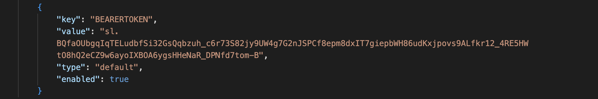

# Dropbox API testing with postman 

## Introduction 

This repository was created for API test automation of the Dropbox cloud based online storage platfom.
The platfom chosen to implement this automated testing is [Postman](https://www.postman.com/) and uses JavaScript as the underlying implementation language. The below section gives a brief overview of how Postman is used in this testing.

## Setup

- clone this repository
- install all dependencies for this project with `npm install` or seperatly => 
- `npm install newman`
- `npm i newman-reporter-htmlextra`

## Refresh Token

Since we are worked with static collection which was exported in sertain period of time and by the Dropbox polices access token only valid for the 4 hours, before running the test new access token should be generated:

- open the terminal
- run command `curl https://api.dropbox.com/oauth2/token -d grant_type=refresh_token -d refresh_token=<***  ADD REFRESH TOKEN HERE ***> -u <*** ADD base64 code HERE ***>`
- from the response copy value of the access token
- open postman_environment.json file find the key `BEARERTOKEN` and paste copied access token to it value

<!--  -->

## Running test

- navigate to the project directory 
- open terminal
- to run the test: `npm run test`
- to run the test, generate report: `npm run test & npm run report` 
- to open report navigate to the newly created newman folder and open html file in your browser